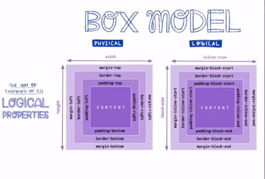

## Modo de escritura

- display: block (es de arriba hacia abajo)
- display: inline (es ubicdao de izquierda a derecha)

## Propiedades fisicas y logicas

ejemplo de borders

| Propiedad | Propiedad logica 
|----------|----------|
| Border-top    | Border-block-start   |
| Border-left    | Border-inline-start   |
|  border-[right,bottom]   |border-[inline-end,block-end]   |

## FLEXBOX
- justify-content se enfoca en el eje principal y align-items se enfoca en el eje secundario.
    - Cuando hacemos un display:flex; la dirección por defecto es row, por lo que nuestro eje principal es el eje horizontal y nuestro eje secundario es el vertical.